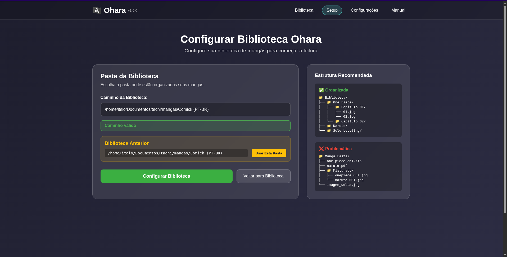
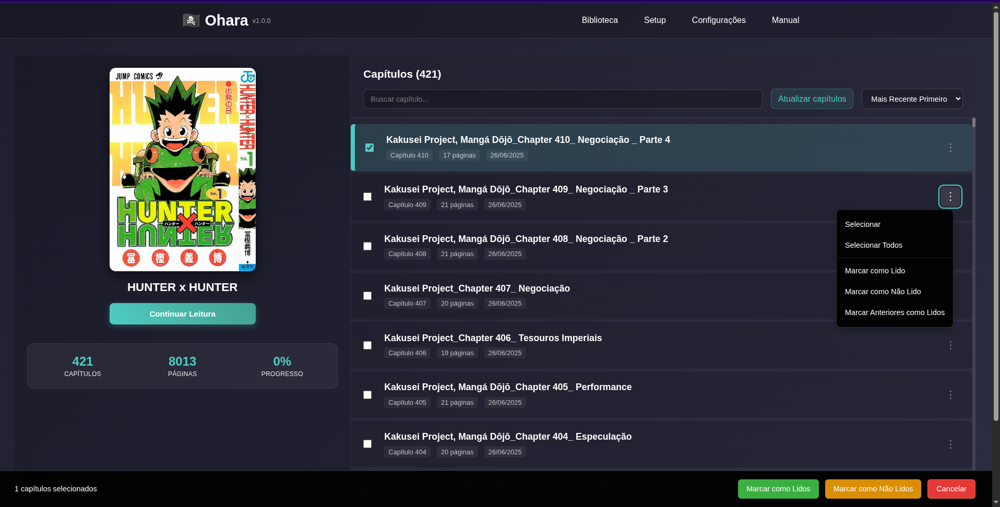
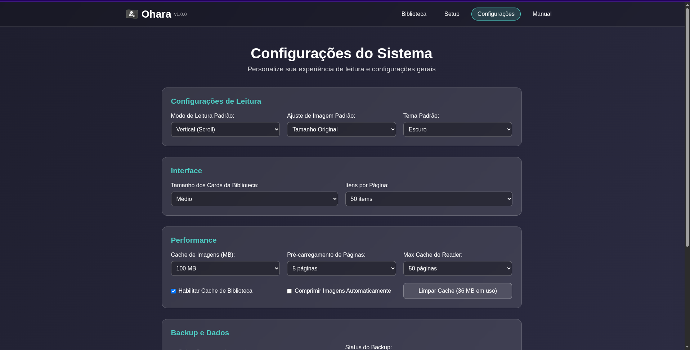

# Ohara - Leitor de Mangá Local

## Membros do Grupo
- Ítalo Dell Areti
- Raquel Gonçalves Rosa

## Descrição do Sistema

Sistema web para leitura de mangás organizados localmente. O Ohara escaneia estruturas de pastas contendo mangás, organiza automaticamente por capítulos e oferece uma interface intuitiva para leitura com acompanhamento de progresso.

**Funcionalidades principais:**
- Escaneamento automático de bibliotecas de mangás
- Organização automática por mangás e capítulos
- Interface de leitura responsiva com navegação por páginas
- Sistema de cache híbrido para alta performance
- Acompanhamento de progresso de leitura
- Servir de imagens com validação de segurança

## Screenshots

<div align="center">

### Interface Principal


### Biblioteca de Mangás


### Navegação de Capítulos


### Página de Leitura


### Configurações


### Manual


</div>

## Demonstração

[](ohara.mp4)

*Clique na imagem acima para assistir ao vídeo de demonstração do sistema*

## Tecnologias Utilizadas

**Frontend:**
- Vue.js 3 (Composition API)
- Vue Router 4 - Roteamento
- Pinia - Gerenciamento de estado
- Vite - Build tool e dev server
- Axios - Cliente HTTP

**Backend:**
- FastAPI - Framework web Python
- Uvicorn - Servidor ASGI
- Pydantic - Validação de dados
- Python 3.10+

**Armazenamento:**
- JSON - Dados e cache local
- LocalStorage - Configurações do usuário

## Como Executar

### Pré-requisitos
- Python 3.10+
- Node.js 18+ e npm
- Git

### 1. Clonar Repositório
```sh
git clone git@github.com:Dellareti/ohara.git
cd ohara
```

### 2. Backend
```sh
cd backend
python -m venv venv
source venv/bin/activate  # Linux/Mac
# venv\Scripts\activate   # Windows
pip install -r requirements.txt
python -m app.main
```
**Backend:** http://localhost:8000  
**API Docs:** http://localhost:8000/api/docs

### 3. Frontend
```sh
cd frontend
npm install
npm run dev
```
**Frontend:** http://localhost:5173

## Estrutura da Biblioteca

O Ohara funciona esperando esse tipo de organização, e recomenda-se:

```
biblioteca/
├── Berserk/
│   ├── capa.jpg                    # Thumbnail (opcional)
│   ├── Capítulo 1/
│   │   ├── 001.jpg
│   │   ├── 002.jpg
│   │   └── 003.jpg
│   └── Capítulo 2/
│       └── ...
├── One Piece/
│   ├── Cap 1/
│   └── Cap 2/
└── Hunter x Hunter/
    ├── Ch 1/
    └── Ch 2/
```

**Formatos suportados:**
- Imagens: JPG, JPEG, PNG, GIF, WebP, BMP
- Qualquer nome de pasta é aceito
- Detecção automática de capítulos

## Arquitetura

### Backend (FastAPI)
- **MangaScanner**: Escaneia e indexa bibliotecas
- **SimpleCache**: Cache inteligente baseado em timestamps
- **LibraryState**: Estado global da biblioteca
- **API REST**: Endpoints seguros para comunicação
- **Image Server**: Servir imagens com validação

### Frontend (Vue.js)
- **Stores (Pinia)**: Library, Reader, Settings
- **Components**: Library, Reader, Settings, Manual
- **Services**: API client com interceptadores
- **Router**: Navegação com guards

## Principais Endpoints

### Biblioteca
- `POST /api/scan-library` - Escanear biblioteca
- `GET /api/library` - Obter biblioteca atual
- `GET /api/validate-path` - Validar caminho

### Mangás e Capítulos
- `GET /api/manga/{manga_id}` - Detalhes do mangá
- `GET /api/manga/{manga_id}/chapter/{chapter_id}` - Páginas do capítulo

### Progresso
- `POST /api/progress/{manga_id}/{chapter_id}` - Salvar progresso
- `GET /api/progress/{manga_id}` - Obter progresso

### Utilitários
- `GET /api/image?path=` - Servir imagens
- `GET /api/cache/info` - Status do cache
- `GET /health` - Health check

## Performance

### Cache Híbrido
- **Detecta mudanças**: Apenas reprocessa arquivos modificados
- **90% mais rápido**: Em re-escaneamentos
- **Inteligente**: Baseado em timestamps de modificação


## Testes

```bash
# Backend - Todos os testes
cd backend
pytest
```

# Com cobertura
```bash
pytest --cov=app --cov-report=html
```

# Testes específicos
```bash
pytest tests/unit/api/
pytest tests/unit/models/test_manga.py

```

## Troubleshooting

### Problemas Comuns

** "Pasta não contém subdiretórios"**
- Verifique se há pastas de mangás na biblioteca
- Certifique-se de que mangás têm subpastas de capítulos

** "Caminho não encontrado"**
- Confirme se o caminho existe e está correto
- Verifique permissões de leitura
- Evite caracteres especiais no caminho

** "Imagens não carregam"**
- Confirme formatos suportados (JPG, PNG, GIF, WebP)
- Verifique se backend está rodando na porta 8000
- Limpe cache: acesse http://localhost:8000/api/cache/clear

** "Performance lenta"**
- Verifique cache: http://localhost:8000/api/cache/info
- Evite bibliotecas em drives de rede
- Considere usar SSD para bibliotecas grandes

### Debug e Logs
```bash
# Status do sistema
curl http://localhost:8000/health
curl http://localhost:8000/api/cache/info
curl http://localhost:8000/api/debug

# Logs detalhados
cd backend
python -m app.main  # Logs aparecem no terminal
```
